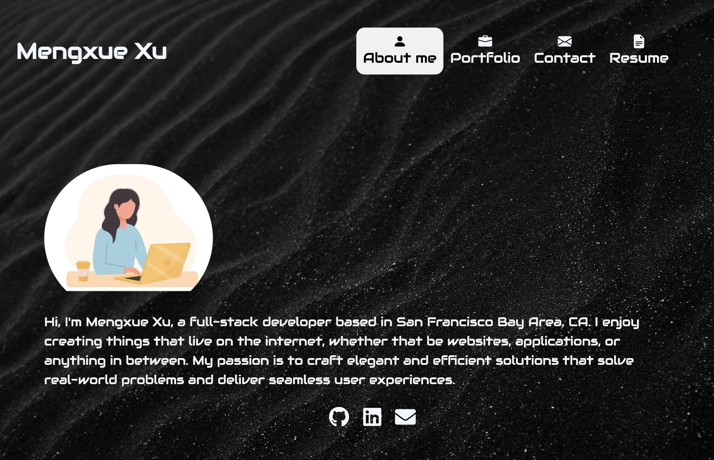
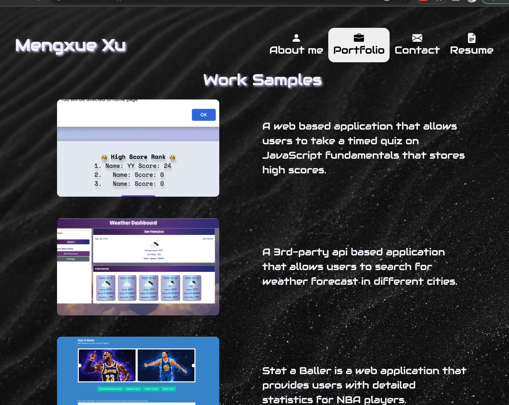
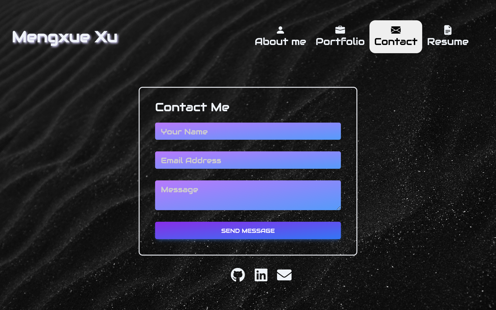
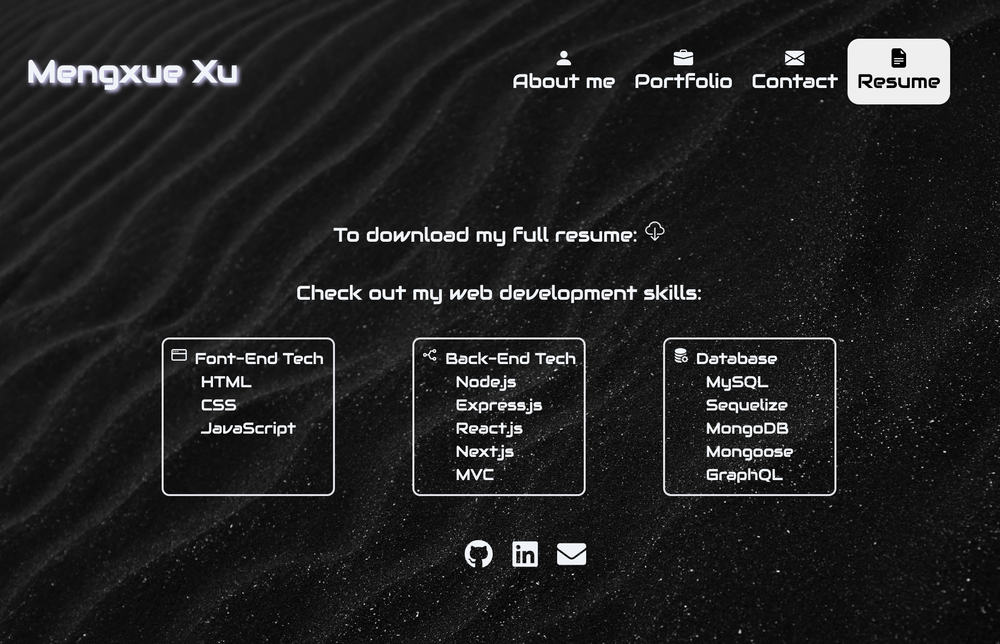

#  React Portfolio

Module 20 - React Challenge

## Description
This single-page application includes my showcase of deployed portfolio of work samples, my development skills, and my contact information with downloadable resume.

 ## Table of Contents:  
- [Deployment](#deployment)  
- [dependencies](#dependencies)
- [Screenshots](#screenshots)
- [Run Locally](#run-locally)
- [Tech Stack](#tech-stack)


## Deployment

[Click here for the deployed application](https://mxu4321.github.io/react-portfolio-page/)


## Dependencies

```
    "@types/node": "18.15.11",
    "@types/react": "18.0.35",
    "@types/react-dom": "18.0.11",
    "autoprefixer": "10.4.14",
    "next": "13.3.0",
    "postcss": "8.4.21",
    "react": "18.2.0",
    "react-dom": "18.2.0",
    "react-icons": "^4.8.0",
    "tailwindcss": "3.3.1",
    "typescript": "5.0.4"
```
## Screenshots







## Run Locally

To run this application locally, use these following commands in the terminal:

* install all dependecies:
    ```
    npm i
    ```
    
* start the server:
    ```
    npm run dev
    ```
* Open this URL in your browser:
    ```
    http://localhost:3000
    ```


## Tech Stack


  

 

 


